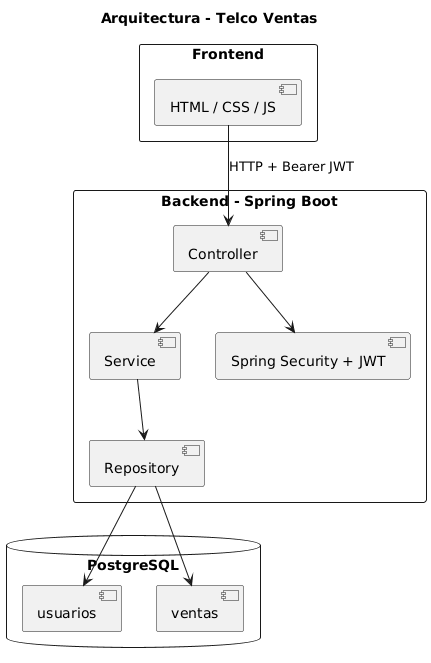

# Documentación Técnica – Telco Ventas

## 1. Diagrama de Arquitectura



---

## 2. Descripción General

El sistema sigue una arquitectura en capas basada en Spring Boot.

Flujo general:

1. El Frontend (HTML/CSS/JS) consume la API vía HTTP.
2. Se envía un token JWT en cada request protegida.
3. Spring Security valida el token y el rol.
4. El Controller recibe la petición.
5. El Service aplica reglas de negocio.
6. El Repository interactúa con PostgreSQL.

---

## 3. Decisiones Técnicas

### Arquitectura

Se implementó una arquitectura en capas:

- **Controller Layer**: Exposición de endpoints REST.
- **Service Layer**: Lógica de negocio y validaciones.
- **Repository Layer**: Persistencia con Spring Data JPA.
- **Base de datos**: PostgreSQL.

Ventajas:

- Separación de responsabilidades.
- Código organizado y mantenible.
- Fácil escalabilidad futura.

---

### Seguridad

Se utilizó:

- Spring Security
- Autenticación JWT (stateless)
- Control de acceso basado en roles

Roles implementados:

- AGENTE
- BACKOFFICE
- SUPERVISOR
- ADMIN

El token JWT se envía mediante:

Authorization: Bearer <token>

---

## 4. Modelo de Datos

### Tabla usuarios

- username
- password_hash
- rol
- supervisor_id
- activo

### Tabla ventas

- agente_id
- dni_cliente
- nombre_cliente
- telefono_cliente
- direccion_cliente
- plan_actual
- plan_nuevo
- codigo_llamada (único)
- producto
- monto
- estado (PENDIENTE, APROBADA, RECHAZADA)
- motivo_rechazo
- fecha_registro
- fecha_validacion

Se implementaron índices en:

- estado
- agente_id
- fecha_registro

---

## 5. Reportes

Endpoint:

GET /api/v1/reportes/resumen

Permite al SUPERVISOR:

- Conteos por estado.
- Monto total de ventas aprobadas.
- Serie de ventas por día (YYYY-MM-DD).

Las métricas se calculan mediante agrupaciones en el Service.

---

## 6. Guía de Despliegue Local

### Base de Datos

Crear base:

```
createdb telco
```

Ejecutar scripts:

```
psql -d telco -f schema.sql
psql -d telco -f data.sql
```

---

### Backend

Configurar `application.properties`:

```
spring.datasource.url=jdbc:postgresql://localhost:5432/telco
spring.datasource.username=postgres
spring.datasource.password=123456
spring.jpa.hibernate.ddl-auto=none
```

Ejecutar:

```
mvn spring-boot:run
```

API disponible en:

http://localhost:8080

Swagger:

http://localhost:8080/swagger-ui

OpenAPI JSON:

http://localhost:8080/v3/api-docs